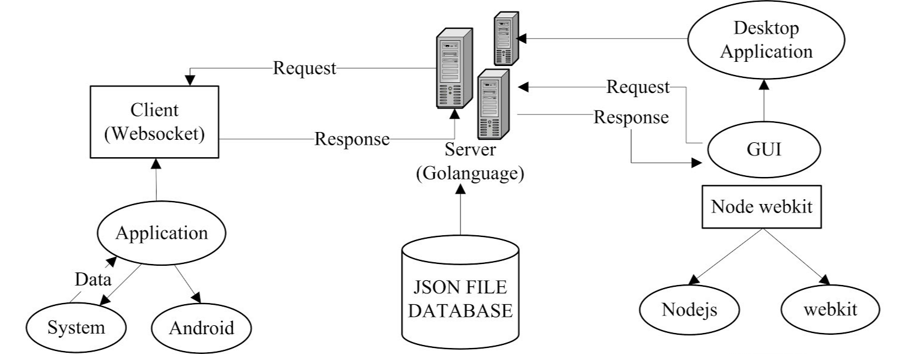
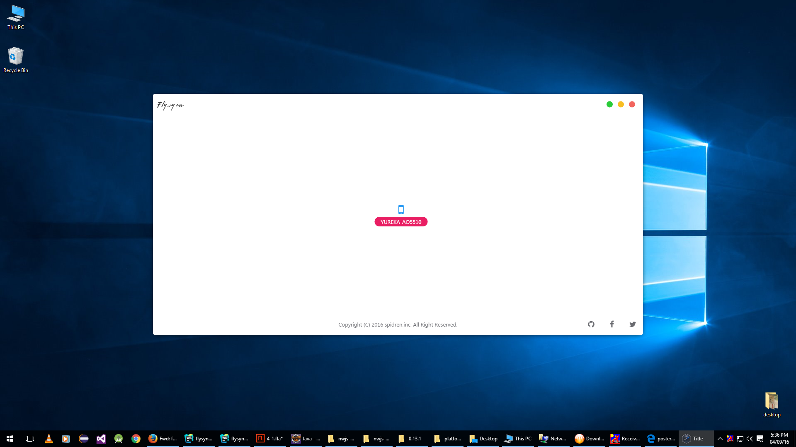
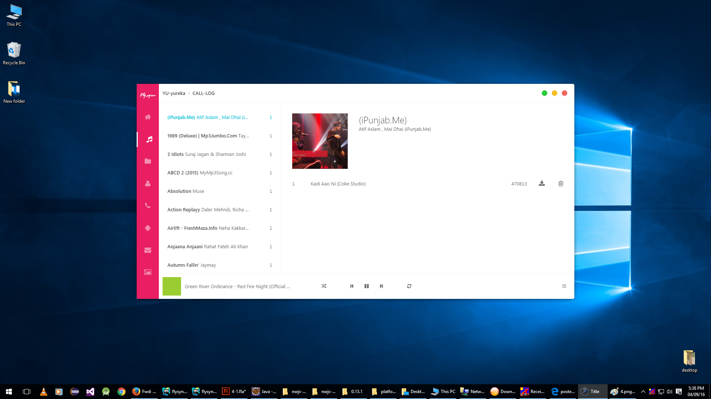
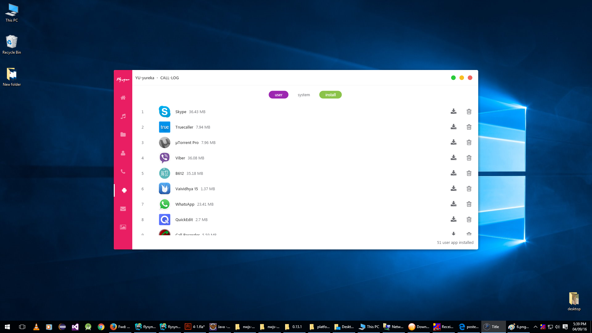
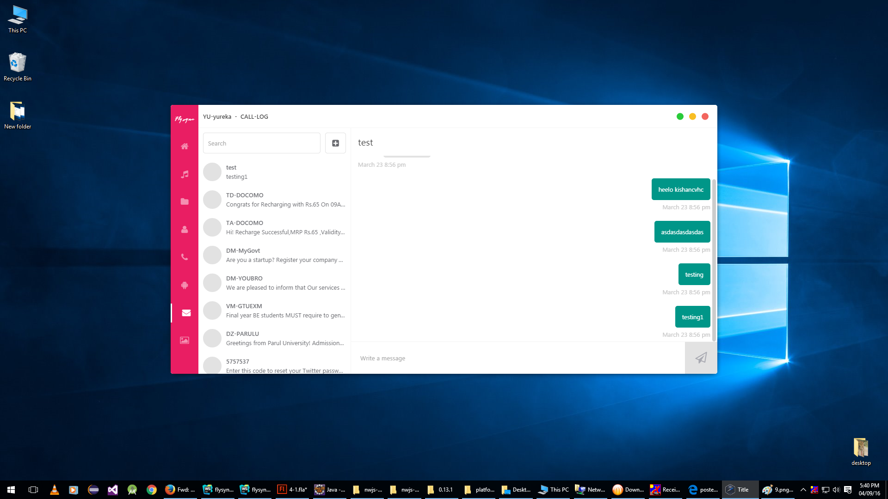
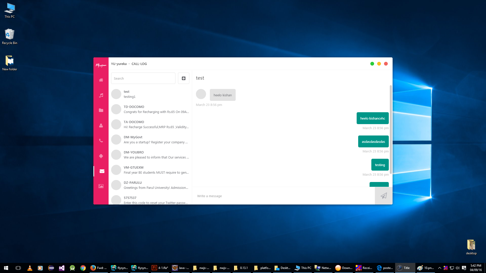
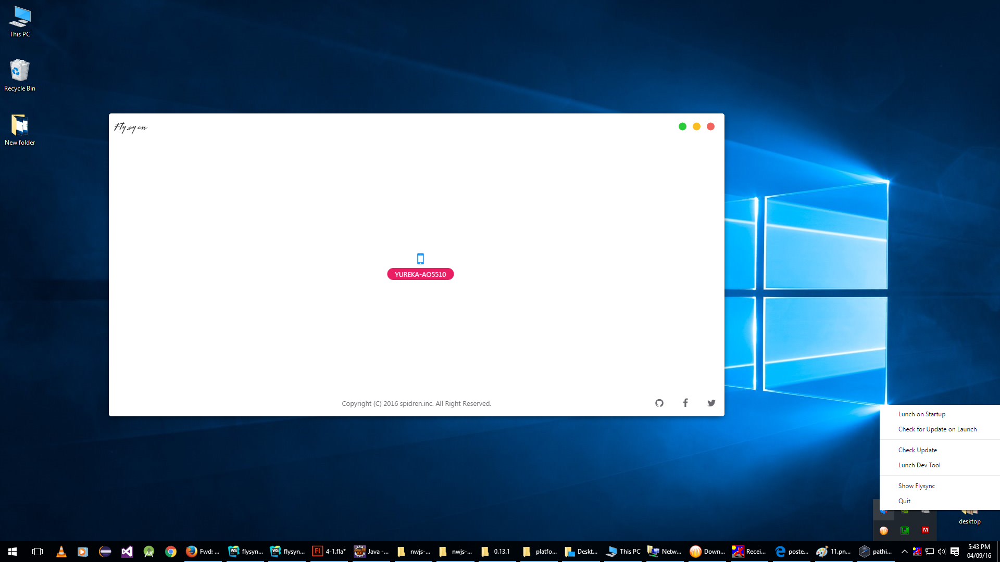

# Flysync - The Android PC Suite  (B.E Final year project 2015-16 | Not maintained any more)

So in our project we tried to make the perfect android pc suite called
Flysync which will provide offline facility. Our Pc suite will also provide cross
platform desktop app. With the use of Flysync we can transfer data as well as we
can manage data from desktop. We can also take backup of our files. We can
manage messages as well as application with the use of Flysync. We will provide
one unique feature i.e. known as selective synchronization. By that user can select
which data he/she want to synchronize with computer or laptop. So security will also
be providing by Flysync.

## Project Development Spilte into Sub-project

1.  [flysync-android](flysync-android) -Android studio project, it's contain android side coding.
2.  [flysync-nw](flysync-nw) - Cross Platform Desktop application project. Using [NW.js](https://nwjs.io/) base on V8,Node Js,Chromium.
3.  [flysync-flash](flysync-flash) - It's contain UI drawing in Adobe Flash Professional.
4.  [flysync-go](flysync-go) - Background server that find android phone in local network(LAN). written in [Go](https://golang.org/).
5.  [flysync-presentation](flysync-presentation) - Final year project presentation.

### flysync-android
for build this project open project in android studio.

### flysync-nw
for bulild desktop app for windwos folow below steps.
1. run comnnad ``npm install`` in [flysync-nw](flysync-nw/) directory.
2. run comnnad ``npm install`` in [flysync-nw/app](flysync-nw/app) directory.
3. (GulpFile.js)[flysync-nw/GulpFile.js] has ``win32`` task for build desktop app for windows os.

### flysync-go
for build background service project.
1. install golang
2. set GOPATH and GOROOT path.
3. build project on via main package.

### flysync-flash
it's conatin ``.fla`` it will open in Adobe Flash Professtional. file contain all UI drawing for desktop and android project.

### flysync-presentation
build this project flow same ``flysync-nw`` steps.

## Project Flow

## Project ShowCase

